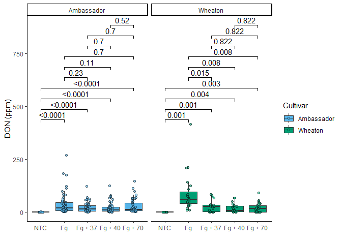
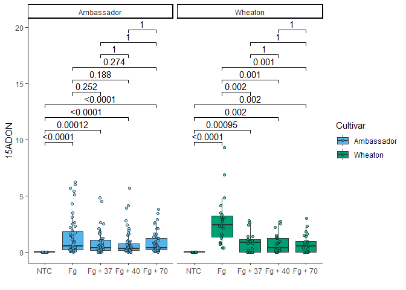
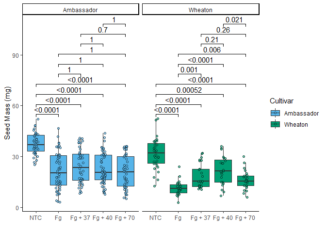
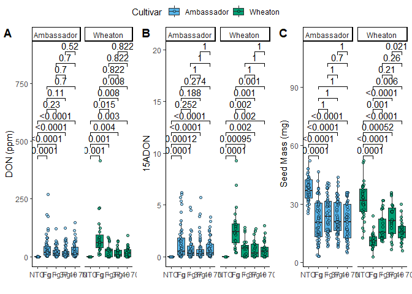

- [Question 1. Explain the
  following:](#question-1.-explain-the-following)
  - [YAML header](#yaml-header)
  - [Literate programming](#literate-programming)
- [Question 2. Take the code you wrote for coding challenge 3 question 5
  and incorporate it into your R markdown file. Your final R markdown
  file should have the following
  elements.](#question-2.-take-the-code-you-wrote-for-coding-challenge-3-question-5-and-incorporate-it-into-your-r-markdown-file.-your-final-r-markdown-file-should-have-the-following-elements.)
  - [DON plot](#don-plot)
  - [X15ADON plot](#x15adon-plot)
  - [seed mass plot](#seed-mass-plot)
  - [combined plot](#combined-plot)
- [Question 3. Knit your document together in the following
  formats:](#question-3.-knit-your-document-together-in-the-following-formats)
- [Question 4. Push the .docx or .pdf and .md files to GitHub inside a
  directory called Coding Challenge
  4.](#question-4.-push-the-.docx-or-.pdf-and-.md-files-to-github-inside-a-directory-called-coding-challenge-4.)
- [Question 5. Now edit, commit, and push the README file for your
  repository and include the following
  elements.](#question-5.-now-edit-commit-and-push-the-readme-file-for-your-repository-and-include-the-following-elements.)
- [Question 6. Please provide a clickable link to your
  GitHub](#question-6.-please-provide-a-clickable-link-to-your-github)

[link to souce publication](https://doi.org/10.1094/PDIS-06-21-1253-RE)

# Question 1. Explain the following:

## YAML header

The YAML header begins every R Markdown document. It includes title,
author, date, and also details on how the document will be knit (html,
pdf, etc.)

## Literate programming

Literate programming is a type of programming documentation that
includes explanatory chunks of natural language as well as code. R
Markdown files are an example of literate programming.

# Question 2. Take the code you wrote for coding challenge 3 question 5 and incorporate it into your R markdown file. Your final R markdown file should have the following elements.

- At the top of the document, make a clickable link to the manuscript
  where these data are published.
- Read the data using a relative file path with na.strings option set to
  “na”. This means you need to put the Mycotoxin.csv file we have used
  for the past two weeks into your directory, which git tracks.
- Make a separate code chunk for the figures plotting the DON data,
  15ADON, and seedmass, and one for the three combined using
  ggarrange().

## DON plot

``` r
DONplot.stats <- DONplot +
  geom_pwc(aes(group = Treatment), method = "t.test", label = "p.adj.format")
DONplot.stats
```

<!-- -->

## X15ADON plot

``` r
X15ADONplot.stats <- X15ADONplot +
  geom_pwc(aes(group=Treatment), method = "t.test", label = "p.adj.format")
X15ADONplot.stats
```

<!-- -->

## seed mass plot

``` r
seedmassplot.stats <- seedmassplot +
  geom_pwc(aes(group=Treatment), method = "t.test", label = "p.adj.format")
seedmassplot.stats
```

<!-- -->

## combined plot

``` r
combinedfigure.stats <- ggarrange(DONplot.stats, X15ADONplot.stats, seedmassplot.stats, labels = "AUTO", nrow = 1, ncol = 3, common.legend = T)
combinedfigure.stats
```

<!-- -->

# Question 3. Knit your document together in the following formats:

- .docx (word document) OR a [.pdf with a table of
  contents](codingpractice4.pdf)
- [Github flavored markdown file](codingpractice4.knit.md)

# Question 4. Push the .docx or .pdf and .md files to GitHub inside a directory called Coding Challenge 4.

That’s where we are right now!

# Question 5. Now edit, commit, and push the README file for your repository and include the following elements.

- A clickable link in your [README file](README.md) to your GitHub
  flavored .md file

- A file tree of your GitHub Repository

  See README link above

# Question 6. Please provide a clickable link to your GitHub

[Here it is!](https://github.com/emaul2/Coding-Challenge-4.git)
